# windows_ls

## 参数指南（记得要给本程序创建环境变量）

### -l	以长格式列出文件信息，包括权限、大小、修改日期和时间等

### -a	显示所有文件，包括隐藏文件（. 和 ..）

### -R	递归地列出指定目录及其子目录中的文件

### -x	横向排布文件，一行一行地列出文件

### -s	按文件大小排序

### -d	仅显示目录

### -t	按最后修改时间排序

### --version 显示版本号、作者信息和开源地址

### --help	显示帮助信息

### 支持特定文件的高亮显示，支持组合参数（除了-s和-t一起用）

## 演示

```bash
ls
```

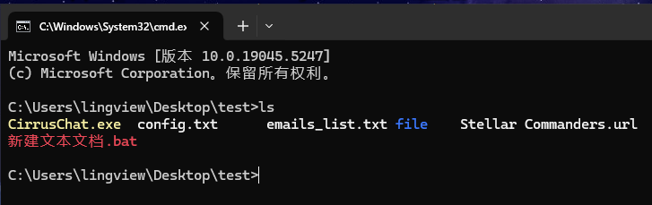

```bash
ls -l
```

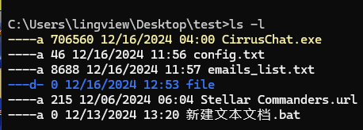

```bash
ls -ls
```

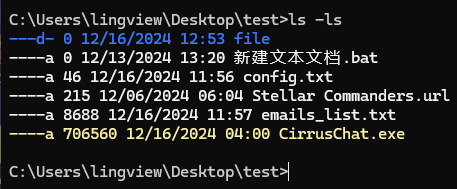

```bash
ls -lt
```

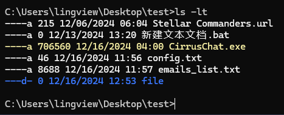

```bash
ls -lR 
```

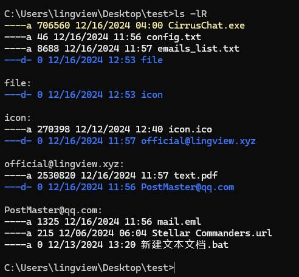

```bash
ls -lRs
```

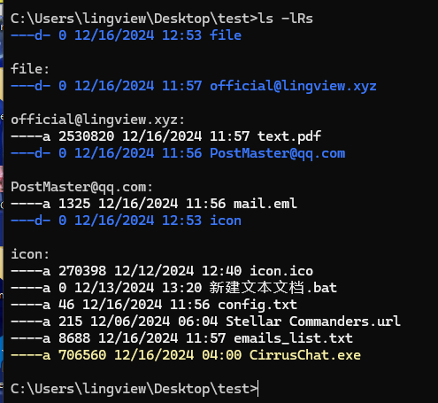

```bash
ls -lRt
```

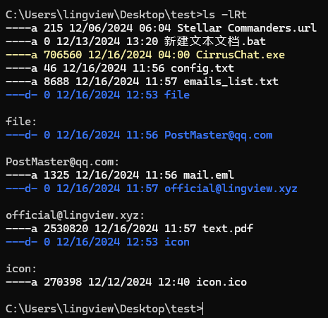

```bash
ls -R
```

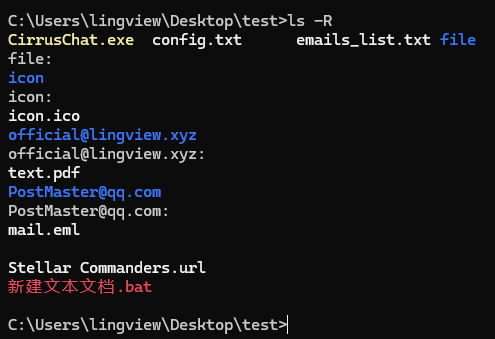

```bash
ls -Rt
```

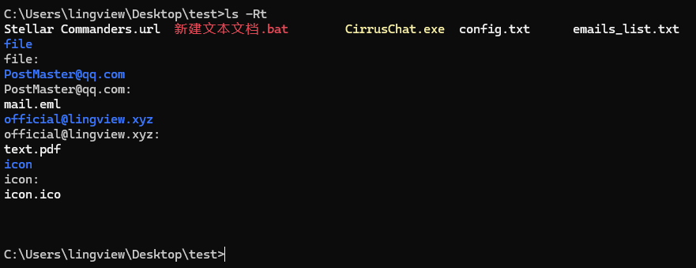

```bash
ls -Rs
```

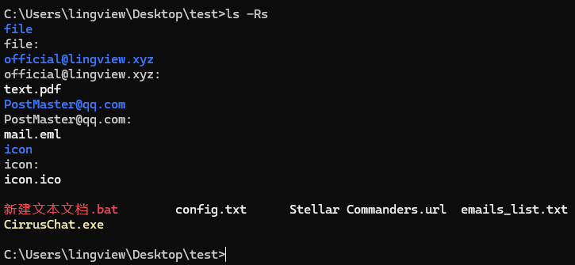

```bash
ls --version
```

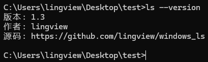

```bash
ls --help
```

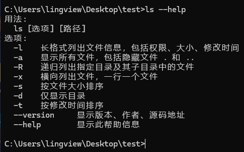
